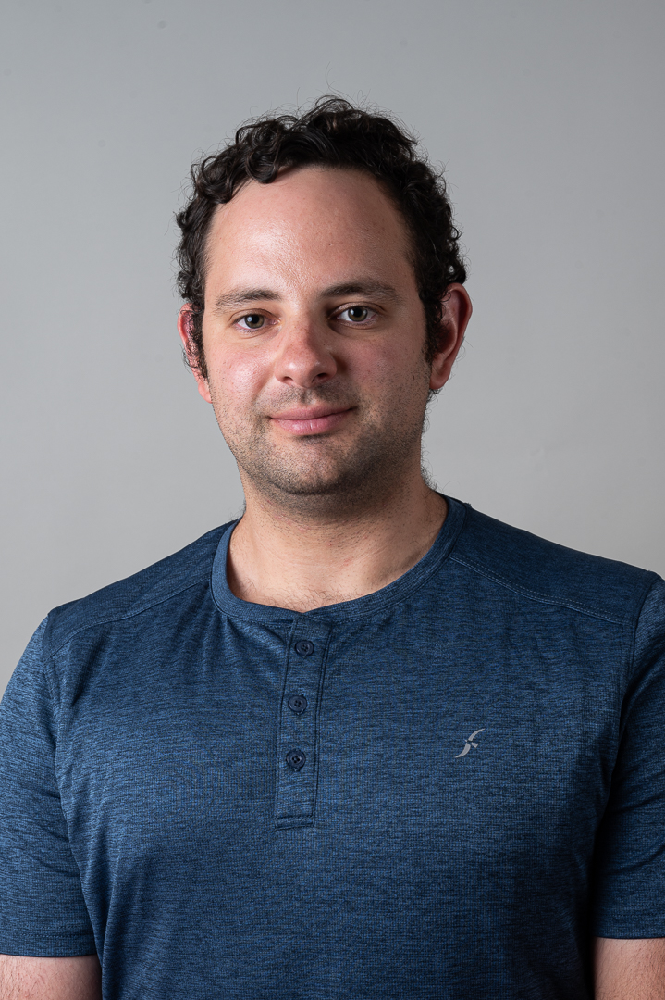

## Who I am
Hi, my name is [Noam Ariel](https://www.weizmann.ac.il/MCMS/shimanovich/group-members). I am 30 years old and have a wonderful wife and a lovely child.

Today, I am a PhD student in chemistry at [Ulyana Shimanovich's lab](https://www.weizmann.ac.il/MCMS/shimanovich/) at the [Weizmann Institute of Science](https://www.weizmann.ac.il/pages/).

## My Phd research
I study the silk produced by caddisfly larvae. While silkworm silk has remarkable properties—such as exceptional strength, high stretch, flexibility, biodegradability, and non-toxicity to the human body—caddisfly larva silk possesses additional advantages. These include non-dissolvable and underwater adhesiveness, which are related to their aquatic habitat.

I would like to understand the chemistry behind the synthesis and secretion process of this silk. This knowledge will assist me in developing artificial silk that shares similar properties to caddisfly larva silk.

## My M.Sc. thesis
In [Sergey Semenov's lab](https://www.weizmann.ac.il/Organic_Chemistry/Semenov/) at the [Weizmann Institute of Science](https://www.weizmann.ac.il/pages/), an organic network system was developed that demonstrates Turing's pattern through organic chemistry reactions. Turing's model involves two types of molecules: activators and inhibitors. The activator enhances itself production through positive feedback while simultaneously producing an inhibitor that reacts with the activator, thus inhibiting its reactivity. In this system, the diffusion coefficient of the inhibitor must be significantly higher than that of the activator.

In my research, we utilized a different system featuring one type of activator and two types of inhibitors: a fast inhibitor and a slow inhibitor. We discovered, using a mathematical model, that reducing the diffusion coefficient of the fast inhibitor enhances the resolution of feature patterns. Then we confirmed this theoretical finding experimentally. 

This work is currently in preprint and has not yet been published. A link to the work will be provided here in the future.

## Education

Today PhD student in chemistry at [Weizmann Institute of Science](https://www.weizmann.ac.il/pages/) 
08.2021- 05.2025 M.Sc. Chemistry  from the [Weizmann Institute of Science](https://www.weizmann.ac.il/pages/) 
09.2019- 08.2021 B.Sc. Chemistry and Biology from the [Hebrew University of Jerusalem](https://en.huji.ac.il/)

## Experiences

Organic chemistry, Matlab, and Hazardous Materials

## Hobbies
Hiking, Board games, Video games, Writing, Poetry, Books, Movies, and drinking a good beer.

## Languages
Hebrew- Native
English- Fluent

